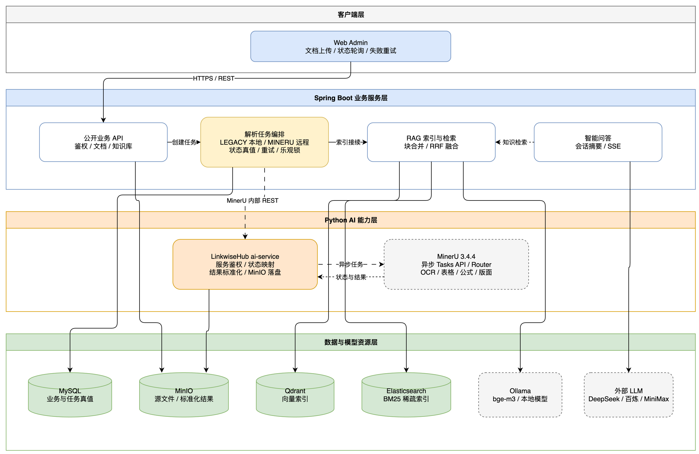

# AI 服务与 MinerU 接入

## 服务职责

`ai-service/` 是 LinkwiseHub 内部 Python AI 能力服务。首期职责是对接 MinerU、统一任务状态、标准化解析结果并写入 MinIO，不直接访问 MySQL、Qdrant 或 Elasticsearch。

MinerU 是 OCR、版面分析和结构化文档解析引擎，不等同于智能体。工具调用、任务规划和工作流编排将在出现明确业务场景后再增加。

## 调用链

1. Web Admin 把文件和解析策略提交给 Spring Boot。
2. Java 校验文件、写入 MinIO，并创建 `lwh_ai_document` 和 `lwh_ai_processing_job`，统一返回 HTTP 202。
3. Python 从 MinIO 流式读取源文件，调用 MinerU `POST /tasks`。
4. Java 调度器轮询 Python，Python映射 MinerU 的任务状态。
5. MinerU 完成后，Python写入 `content.md`、`blocks.json`、`manifest.json` 和图片资源。
6. Java读取标准化块，保留页码、块类型和标题元数据，再写入 MySQL、Qdrant 和 Elasticsearch。

## 解析策略

- `LEGACY`：由任务调度器异步执行现有 Java/PDFBox/POI 解析链路。
- `MINERU`：PDF、DOCX、PPTX、XLSX 和常见图片使用 MinerU；不支持的格式直接拒绝。
- `AUTO`：MinerU支持的现代格式交给 MinerU，TXT、MD、DOC、XLS 使用旧解析器。

默认值是 `LEGACY`，已有文档不会自动重解析。MinerU失败不会静默切换解析器，达到最大重试次数后可在页面显式选择策略重试。

## 配置

Java 环境变量：

```text
AI_DOCUMENT_PARSE_STRATEGY=LEGACY
AI_SERVICE_BASE_URL=http://127.0.0.1:8090
AI_SERVICE_TOKEN=<shared-service-token>
AI_DOCUMENT_SCHEDULER_ENABLED=true
AI_DOCUMENT_TASK_TIMEOUT_MINUTES=60
AI_DOCUMENT_MAX_ATTEMPTS=3
```

Python 环境变量见 `ai-service/.env.example`。生产环境必须使用独立服务令牌和最小权限 MinIO 账号，不得把真实密钥写入仓库。

## 内部接口

- `POST /internal/v1/document-parses`：提交解析任务。
- `GET /internal/v1/document-parses/{taskId}`：查询任务状态。
- `POST /internal/v1/document-parses/{taskId}/materialize`：标准化并落盘解析结果。
- `GET /health/live`：进程存活检查。
- `GET /health/ready`：MinerU 和 MinIO 就绪检查。

内部接口要求 `X-Service-Token`，不接受浏览器直接访问。Web Admin 始终只调用 Java API。

## 资源与故障处理

- MinerU单实例默认并发为 1，多 GPU 环境使用 `mineru-router` 扩展。
- Java 调度器使用任务锁和版本号避免多实例重复处理。
- 任务最长默认 60 分钟，提交或执行失败最多尝试 3 次。
- Python临时目录在任务提交结束后立即清理；解析产物按 `parsed/{documentId}/{taskId}` 存放，图片保留在其 `images/` 子目录。
- 知识文档附件解析失败但正文有效时，正文继续建立索引，任务错误保留为警告。



架构源文件位于 [architecture/ai-service-architecture.drawio](architecture/ai-service-architecture.drawio)，PNG 内也已嵌入可编辑的 Draw.io 数据。
